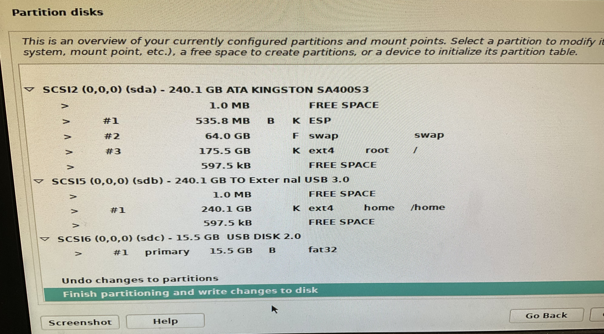

# Class Server Setup


Setup instructions for Debian server for high school classroom.

## Loading Debian

- my setup has 2 drives:
  - 1 for OS
  - 1 for /home directories

- setup hard drives and partions as follows:
  - ensure you have a "LARGE" swap file
  - DO NOT load any software (web server, SSH, ...), only a GUI (if you want)


## After OS Loading Setup

- after the server is up and running install the following, logged in as "root"!
  - update server packages
    - ```sh
      apt update && upgrade -y
      ```
  - add mr-coxall user to sudo
    - ```sh
      usermod -aG sudo mr-coxall
      ```
  - allow root to login to GUI:
    - ```sh
      nano /etc/pam.d/gdm-password
      auth required pam_succeed_if.so user != root quiet
      ```
  - install various Linux tools:
    - ```sh
      apt install curl -y
      apt install git -y
      apt install gh -y
      apt install tree -y
      apt install neofetch -y
      apt install podman -y
      ```
  - install openssh_server:
    - ```sh
      apt install openssh-server -y
      systemctl start ssh
      systemctl status ssh
      ```
  - install NeoVim:
    - ```sh
      cd /tmp
      apt-get install ninja-build gettext cmake unzip curl
      git clone https://github.com/neovim/neovim
      cd neovim && make CMAKE_BUILD_TYPE=RelWithDebInfo
      make install

      ```
    - add course groups
    - ```sh
      groupadd ICD2O
      groupadd ICS3U
      groupadd ICS4U
      ```
    - load appache2
    - ```sh
      sudo apt install apache2 -y
      ```
    - turn on user webpages for apache
    - ```sh
      a2enmod userdir
      systemctl restart apache2
      ```
    - install PHP & MySQL
    - ```sh
      apt install php-fpm php-mysql -y
      systemctl status php8.2-fpm
      a2enmod proxy_fcgi setenvif
      a2enconf php8.2-fpm
      systemctl restart apache2
      ```
    - now test the PHP installation
        - ```sh
          echo "<?php phpinfo(); ?>" | sudo tee /var/www/html/info.php
          goto: http://your-server-ip/info.php
          ```
    - install GNU compiler
        - ```sh
          apt install build-essential -y
          gcc --version
          g++ --version
          ```
    - install bun
        - ```sh
          curl -fsSL https://bun.sh/install | bash
          source /root/.bashrc
          bun --version
          ```
    - install Java
        - ```sh
          apt install default-jdk -y
          java --version
          ```
    - update add user defaults
      - web directory
      - default file permissions
      - set default .bashrc
      - force reset password
      - default shell
    - run adduser script to add in students
        - ```sh
          useradd -m pcoxall
          ```
